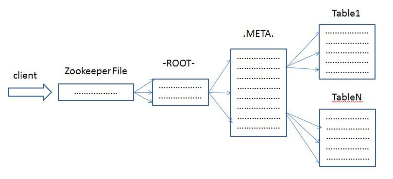
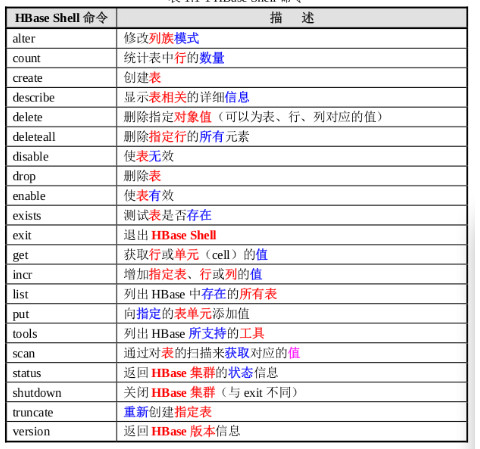

# Apache HBase课程设计

## 1、 HBase基础

### 1.1 基本概念

[官方地址](http://hbase.apache.org/)

* hbase是bigtable的开源java版本，是建立在hdfs之上。

* 提供高可靠性、高性能、列存储、可伸缩、实时读写nosql的数据库系统。
  * 它介于nosql和RDBMS之间，仅能通过主键(row key)和主键的range来检索数据，仅支持单行事务(可通过hive支持来实现多表join等复杂操作)。
  * 主要用来存储结构化和半结构化的松散数据。
    * Hbase查询数据功能很简单，不支持join等复杂操作，不支持复杂的事务（行级的事务）
    * Hbase中支持的数据类型：byte[]
    * 与hadoop一样，Hbase目标主要依靠横向扩展，通过不断增加廉价的商用服务器，来增加计算和存储能力。

* HBase中的表一般有这样的特点：
  * 大：一个表可以有上十亿行，上百万列
  * 面向列:面向列(族)的存储和权限控制，列(族)独立检索。
  * 稀疏:对于为空(null)的列，并不占用存储空间，因此，表可以设计的非常稀疏。

* 和行式数据库的区别

  * 1、行式数据库在分析的时候，将id,name,age,sex,score;完整的信息读入内存，造成大量的内存和IO浪费。

  * 2、列式数据库的思维是把行式数据库全部拆开，按照列的方式重新组合存储，一列所有的行的数据存放在一起。带来的好处就是，要分析男女就直接访问所有的男女信息，要分析销售额，就直接访问消费额相关的数据。

    

    ​


### 1.2 Hbase表结构


* 表(table)：用于存储管理数据，具有稀疏的、面向列的特点。HBase中的每一张表，就是所谓的大表(Bigtable)，可以有上亿行，上百万列。对于为值为空的列，并不占用存储空间，因此表可以设计的非常稀疏。
* 行键(RowKey)：类似于MySQL中的主键，HBase根据行键来快速检索数据，一个行键对应一条记录。与MySQL主键不同的是，HBase的行键是天然固有的，每一行数据都存在行键。
* 列族(ColumnFamily)：是列的集合。列族在表定义时需要指定，而列在插入数据时动态指定。列中的数据都是以二进制形式存在，没有数据类型。在物理存储结构上，每个表中的每个列族单独以一个文件存储(参见图1.2)。一个表可以有多个列簇。
* 时间戳(TimeStamp)：是列的一个属性，是一个64位整数。由行键和列确定的单元格，可以存储多个数据，每个数据含有时间戳属性，数据具有版本特性。可根据版本(VERSIONS)或时间戳来指定查询历史版本数据，如果都不指定，则默认返回最新版本的数据。
* 区域(Region)：HBase自动把表水平划分成的多个区域，划分的区域随着数据的增大而增多。

动手实践：将以下用户的信息保存到Hbase中


​	

​				

​		

### 1.3 Hbase整体结构


#### 1.3.1 Client

* ①使用HBase RPC机制与HMaster和HRegionServer进行通信；
* ②Client与HMaster进行通信进行管理类操作；
* ③Client与HRegionServer进行数据读写类操作。

#### 1.3.2 Zookeeper

* ①保证任何时候，集群中只有一个running master，避免单点问题；
* ②存贮所有Region的寻址入口，包括-ROOT-表地址、HMaster地址；
* ③实时监控Region Server的状态，将Region server的上线和下线信息，实时通知给Master；
* ④存储Hbase的schema，包括有哪些table，每个table有哪些column family。

#### 1.3.3 HMaster

可以启动多个HMaster，通过Zookeeper的Master Election机制保证总有一个Master运行。

角色功能：

* ①为Region server分配region；
* ②负责region server的负载均衡；
* ③发现失效的region serve并重新分配其上的region；
* ④GFS上的垃圾文件回收；
* ⑤处理用户对标的增删改查操作。

#### 1.3.4 HRegionServer

HBase中最核心的模块，主要负责响应用户I/O请求，向HDFS文件系统中读写数据。

作用：

* ①维护Master分配给它的region，处理对这些region的IO请求；
* ②负责切分在运行过程中变得过大的region。
* 此外，HRegionServer管理一些列HRegion对象，每个HRegion对应Table中一个Region，HRegion由多个HStore组成，每个HStore对应Table中一个Column Family的存储，Column Family就是一个集中的存储单元，故将具有相同IO特性的Column放在一个Column Family会更高效。

#### 1.3.4 HStore

HBase存储的核心，由MemStore和StoreFile组成。

用户写入数据的流程为：client写入 -> 存入MemStore，一直到MemStore满 -> Flush成一个StoreFile，直至增长到一定阈值 -> 触发Compact合并操作 -> 多个StoreFile合并成一个StoreFile，同时进行版本合并和数据删除 -> 当StoreFiles Compact后，逐步形成越来越大的StoreFile -> 单个StoreFile大小超过一定阈值后，触发Split操作，把当前Region Split成2个Region，Region会下线，新Split出的2个孩子Region会被HMaster分配到相应的HRegionServer上，使得原先1个Region的压力得以分流到2个Region上，如图所示。


#### 1.3.6 HRegion

​	一个表最开始存储的时候，是一个region。

​	一个Region中会有个多个store，每个store用来存储一个列簇。如果只有一个column family，就只有一个store。

​	region会随着插入的数据越来越多，会进行拆分。默认大小是10G一个。

#### 1.3.7 HLog

在分布式系统环境中，无法避免系统出错或者宕机，一旦HRegionServer意外退出，MemStore中的内存数据就会丢失，引入HLog就是防止这种情况。

工作机制：每个HRegionServer中都会有一个HLog对象，HLog是一个实现Write Ahead Log的类，每次用户操作写入Memstore的同时，也会写一份数据到HLog文件，HLog文件定期会滚动出新，并删除旧的文件(已持久化到StoreFile中的数据)。当HRegionServer意外终止后，HMaster会通过Zookeeper感知，HMaster首先处理遗留的HLog文件，将不同region的log数据拆分，分别放到相应region目录下，然后再将失效的region重新分配，领取到这些region的HRegionServer在Load Region的过程中，会发现有历史HLog需要处理，因此会Replay HLog中的数据到MemStore中，然后flush到StoreFiles，完成数据恢复。

### 1.4 查询路由

  HBase中存有两张特殊的表，-ROOT-和.META.。

* .META.：记录了用户表的Region信息，.META.可以有多个regoin。
*  -ROOT-：记录了.META.表的Region信息，-ROOT-只有一个region。Zookeeper中记录了-ROOT-表的location。

     Client访问用户数据之前需要首先访问zookeeper，然后访问-ROOT-表，接着访问.META.表，最后才能找到用户数据的位置去访问



## 2、Hbase集群部署

[下载地址](http://mirrors.hust.edu.cn/apache/hbase/1.3.1/hbase-1.3.1-bin.tar.gz)

操作步骤说明：

* 下载安装包
* 修改配置文件
  * regionservers
  * hbase-site.xml
  * hbase-env.sh
  * 拷贝hadoop配置文件
* 分发配置文件
* 启动集群


### 2.1 下载安装包

```
wget http://mirrors.hust.edu.cn/apache/hbase/1.3.1/hbase-1.3.1-bin.tar.gz
tar -zxvf hbase-1.3.1-bin.tar.gz -C /export/servers/
cd ../servers/
mv hbase-1.3.1 hbase
vi /etc/profile
-
export HBASE_HOME=/export/servers/hbase
export PATH=${HBASE_HOME}/bin:$PATH
-
source /etc/profile

```

### 2.2 修改配置文件

```shell
进入配置文件所在的目录
cd /export/servers/hbase/conf/
```

```shell
修改第一个配置文件  regionservers 
vi regionservers 
-
node02
node03

```

```
修改第二个配置文件 hbase-site.xml 

注意：以下配置集成的是hadoop ha集群。
如果您的集群没有配置ha，hbase.rootdir 配置项目需要修改：hdfs://master:9000/hbase
vi hbase-site.xml 
-
<configuration>
  <property>
    <name>hbase.rootdir</name>
    <value>hdfs://ns1/hbase</value>
  </property>
  <property>
     <name>hbase.cluster.distributed</name>
     <value>true</value>
  </property>
  <property>
     <name>hbase.master.port</name>
     <value>16000</value>
  </property>
   <property>
    <name>hbase.zookeeper.property.dataDir</name>
    <value>/export/data/zk/</value>
  </property>
  <property>
    <name>hbase.zookeeper.quorum</name>
    <value>node01,node02,node03</value>
  </property>
  <property>
    <name>hbase.zookeeper.property.clientPort</name>
    <value>2181</value>
  </property>
</configuration>

```

```
修改第三个配置文件 hbase-env.sh

HBASE_MANAGES_ZK=false 表示，hbase和大家伙公用一个zookeeper集群，而不是自己管理集群。

vi hbase-env.sh
-
export JAVA_HOME=/export/servers/jdk
export HBASE_MANAGES_ZK=false

```

```
修改第四个配置文件 拷贝hadoop配置文件

拷贝hadoop的配置文件到hbase的配置文件目录
```

### 2.3 分发安装文件并启动

```
分发配置文件
scp -r /export/servers/hbase/ node02:/export/servers/
scp -r /export/servers/hbase/ node03:/export/servers/

启动集群
startzk.sh
start-dfs.sh
start-hbase.sh
```

```shell
启动异常：
2017-12-27 06:27:54,882 INFO  [node01:16000.activeMasterManager] master.ServerManager: Waiting for region servers count to settle; currently checked in 0, slept for 67247 ms, expecting minimum of 1, maximum of 2147483647, timeout of 4500 ms, interval of 1500 ms.

解决办法：
保证每台机器时间一致。
ntpdate -u 0.uk.pool.ntp.org
ntpdate -u 1.uk.pool.ntp.org
```

。

## 3、Hbase Shell操作

#### 3.1 连接集群

```
hbase shell
```

#### 3.2 创建表

```
create 'user','base_info'
```

#### 3.3 插入数据

```
put 'user','rowkey_10','base_info:username','张三'
put 'user','rowkey_10','base_info:birthday','2014-07-10'
put 'user','rowkey_10','base_info:sex','1'
put 'user','rowkey_10','base_info:address','北京市'

put 'user','rowkey_16','base_info:username','张小明'
put 'user','rowkey_16','base_info:birthday','2014-07-10'
put 'user','rowkey_16','base_info:sex','1'
put 'user','rowkey_16','base_info:address','北京'

put 'user','rowkey_22','base_info:username','陈小明'
put 'user','rowkey_22','base_info:birthday','2014-07-10'
put 'user','rowkey_22','base_info:sex','1'
put 'user','rowkey_22','base_info:address','上海'

put 'user','rowkey_24','base_info:username','张三丰'
put 'user','rowkey_24','base_info:birthday','2014-07-10'
put 'user','rowkey_24','base_info:sex','1'
put 'user','rowkey_24','base_info:address','河南'

put 'user','rowkey_25','base_info:username','陈大明'
put 'user','rowkey_25','base_info:birthday','2014-07-10'
put 'user','rowkey_25','base_info:sex','1'
put 'user','rowkey_25','base_info:address','西安'
```

#### 3.4 查询表中的所有数据

```
scan 'user'
```

#### 3.5 查询某个rowkey的数据

```
get 'user','rowkey_16'
```

#### 3.6 查询某个列簇的数据

```shell
get 'user','rowkey_16','base_info'
get 'user','rowkey_16','base_info:username'
get 'user', 'rowkey_16', {COLUMN => ['base_info:username','base_info:sex']}
```

#### 3.7 删除表中的数据

```
delete 'user', 'rowkey_16', 'base_info:username'
```

#### 3.8 清空数据

```
truncate 'user'
```

#### 3.9  操作列簇

```
alter 'user', NAME => 'f2'
alter 'user', 'delete' => 'f2'
```

#### 3.10 删除表

```
disable 'user'
drop 'user'
```

#### 3.11 命令表



可以通过HbaseUi界面查看表的信息

端口60010打不开的情况，是因为hbase 1.0 以后的版本，需要自己手动配置，在文件 hbase-site

```
<property>  
<name>hbase.master.info.port</name>  
<value>60010</value>  
</property> 
```

#### 

## 4、HBase Java API

#### 4.1 导入pom依赖

```xml
 		<dependency>
            <groupId>org.apache.hbase</groupId>
            <artifactId>hbase-client</artifactId>
            <version>1.3.1</version>
        </dependency>
```

#### 4.2 添加配置文件

在resource目录下创建hbase-site.xml

```xml
<?xml version="1.0"?>
<?xml-stylesheet type="text/xsl" href="configuration.xsl"?>
<configuration>
    <property>
        <name>hbase.zookeeper.quorum</name>
        <value>zk01,zk02,zk03</value>
        <description>The directory shared by region servers.
        </description>
    </property>
</configuration>
```

#### 4.3 连接Hbase

```java
//  hbase的两种连接方式：1）读取配置文件 只需要配置zookeeper 
        Configuration config = HBaseConfiguration.create();
        Connection connection = ConnectionFactory.createConnection(config);
//2）通过代码配置
	    Configuration configuration = new Configuration();
        configuration.set("hbase.zookeeper.quorum", "zk01:2181,zk02:2181,zk03:2181");
        connection = ConnectionFactory.createConnection();
```

#### 4.4 创建表

```java
 public static void main(String[] args) throws IOException {
        // 1.连接HBase
        // 1.1 HBaseConfiguration.create(); 
        Configuration config = HBaseConfiguration.create();
        // 1.2 创建一个连接
        Connection connection = ConnectionFactory.createConnection(config);
        // 1.3 从连接中获得一个Admin对象
        Admin admin = connection.getAdmin();
        // 2.创建表
        // 2.1 判断表是否存在
        TableName tableName = TableName.valueOf("user");
        if (!admin.tableExists(tableName)) {
            //2.2 如果表不存在就创建一个表
            HTableDescriptor hTableDescriptor = new HTableDescriptor(tableName);
            hTableDescriptor.addFamily(new HColumnDescriptor("base_info"));
            admin.createTable(hTableDescriptor);
            System.out.println("创建表");
        }
    }
```

#### 4.5 打印表的信息

```java
@Before
public void initConnection() {
        try {
            connection = ConnectionFactory.createConnection(config);
        } catch (IOException e) {
            System.out.println("连接数据库失败");
        }
}

@Test 
public void tableInfo() throws IOException {
        // 1.定义表的名称
        TableName tableName = TableName.valueOf("user");
        // 2.获取表
        Table table = connection.getTable(tableName);
        // 3.获取表的描述信息
        HTableDescriptor tableDescriptor = table.getTableDescriptor();
        // 4.获取表的列簇信息
        HColumnDescriptor[] columnFamilies = tableDescriptor.getColumnFamilies();
        for (HColumnDescriptor columnFamily : columnFamilies) {
            // 5.获取表的columFamily的字节数组
            byte[] name = columnFamily.getName();
            // 6.使用hbase自带的bytes工具类转成string
            String value = Bytes.toString(name);
            // 7.打印
            System.out.println(value);
        }
    }
```

#### 4.6 添加数据(PUT)


```java
@Before
public void initConnection() {
        try {
            connection = ConnectionFactory.createConnection(config);
        } catch (IOException e) {
            System.out.println("连接数据库失败");
        }
}
@Test
public void put() throws IOException {
        // 1.定义表的名称
        TableName tableName = TableName.valueOf("user");
        // 2.获取表
        Table table = connection.getTable(tableName);
        // 3.准备数据
        String rowKey = "rowkey_10";
        Put zhangsan = new Put(Bytes.toBytes(rowKey));
        zhangsan.addColumn(Bytes.toBytes("base_info"), Bytes.toBytes("username"), Bytes.toBytes("张三"));
        zhangsan.addColumn(Bytes.toBytes("base_info"), Bytes.toBytes("sex"), Bytes.toBytes("1"));
        zhangsan.addColumn(Bytes.toBytes("base_info"), Bytes.toBytes("address"), Bytes.toBytes("北京市"));
        zhangsan.addColumn(Bytes.toBytes("base_info"), Bytes.toBytes("birthday"), Bytes.toBytes("2014-07-10"));
        // 4. 添加数据
        table.put(zhangsan);
        table.close();
}
```

#### 4.7 获取数据(Get)

```
 @Test
public void get() throws IOException {
        // 1.定义表的名称
        TableName tableName = TableName.valueOf("user");
        // 2.获取表
        Table table = connection.getTable(tableName);
        // 3.准备数据
        String rowKey = "rowkey_10";
        // 4.拼装查询条件
        Get get = new Get(Bytes.toBytes(rowKey));
        // 5.查询数据
        Result result = table.get(get);
        // 6.打印数据 获取所有的单元格
        List<Cell> cells = result.listCells();
        for (Cell cell : cells) {
            // 打印rowkey,family,qualifier,value
            System.out.println(Bytes.toString(CellUtil.cloneRow(cell))
                    + "==> " + Bytes.toString(CellUtil.cloneFamily(cell))
                    + "{" + Bytes.toString(CellUtil.cloneQualifier(cell))
                    + ":" + Bytes.toString(CellUtil.cloneValue(cell)) + "}");
        }
}
```

####  4.8 全表扫描（scan 慎用）

```
@Test
public void scan() throws IOException {
        // 1.定义表的名称
        TableName tableName = TableName.valueOf("user");
        // 2.获取表
        Table table = connection.getTable(tableName);
        // 3.全表扫描
        Scan scan = new Scan();
        // 4.获取扫描结果
        ResultScanner scanner = table.getScanner(scan);
        Result result = null;
        // 5. 迭代数据
        while ((result = scanner.next()) != null) {
            // 6.打印数据 获取所有的单元格
            List<Cell> cells = result.listCells();
            for (Cell cell : cells) {
                // 打印rowkey,family,qualifier,value
                System.out.println(Bytes.toString(CellUtil.cloneRow(cell))
                        + "==> " + Bytes.toString(CellUtil.cloneFamily(cell))
                        + "{" + Bytes.toString(CellUtil.cloneQualifier(cell))
                        + ":" + Bytes.toString(CellUtil.cloneValue(cell)) + "}");
            }
        }
}
```

#### 4.9 范围查询（开始行-结束行）

在4.8的基础上修改代码如下

```
 Scan scan = new Scan();
 scan.setStartRow(Bytes.toBytes("rowkey_1"));
 scan.setStopRow(Bytes.toBytes("rowkey_2"));
```

### 5、使用过滤器进行查询

#### 5.1 比较过滤器有几种？

* RowFilter   基于RowKey的过滤
* FamilyFilter 基于列簇的过滤
* QualifierFilter 基于字段的过滤
* ValueFilter 基于值的过滤
* DependentColumnFilter 参考值过滤器

#### 5.2 比较运算符？

* LESS 匹配小于设定值的值
* LESS_OR_EQUAL 匹配小于或等于设定值的值
* EQUAL 匹配等于设定值的值
* NOT_EQUAL 匹配与设定值不相等的值
* GREATER_OR_EQUAL 匹配大于或等于设定值的值
* GREATER 匹配大于设定值的值
* NO_OP 排除一切值

#### 5.3 比较器有哪些？

* BinaryComparator 使用Bytes.compareTo()比较当前的阈值
* BinaryPrefixComparator 与上面的相似，使用Bytes.compareTo()进行匹配，但是是从左端开始前缀匹配
* NullComparator 不做匹配，只判断当前值不是null
* BitComparator 通过BitWiseOp类提供的按位与（AND）、或（OR）、异或（XOR）操作执行位级比较。
* RegexStringComparator 根据一个正则表达式，在实例化这个比较器的时候去匹配表中的数据。
* SubStringComparator 把阈值和表中数据String实例，同时通过contains()操作匹配字符串

#### 5.4 示例代码

```java
//创建RowFilter过滤器
 RowFilter rowFilter = new RowFilter(CompareFilter.CompareOp.EQUAL
                , new BinaryComparator("rowkey_10".getBytes()));
//创建familyFilter过滤器
FamilyFilter familyFilter = new FamilyFilter(CompareFilter.CompareOp.NO_OP,
                new BinaryComparator("base_Info".getBytes()));
//创建qualifierFilter过滤器
QualifierFilter qualifierFilter = new QualifierFilter(CompareFilter.CompareOp.EQUAL,
                new BinaryComparator("username".getBytes()));
        //创建valueFilter过滤器
ValueFilter valueFilter = new ValueFilter(CompareFilter.CompareOp.EQUAL,
                new BinaryComparator("张三".getBytes()));
```

#### 5.5、查询值等于张三的所有数据

```java
@Test
public void tesValueFilter() throws IOException {
        //1、创建过滤器
        ValueFilter filter = new ValueFilter(CompareFilter.CompareOp.EQUAL, new BinaryComparator("张三".getBytes()));
        //2、创建扫描器
        Scan scan = new Scan();
        //3、将过滤器设置到扫描器中
        scan.setFilter(filter);
        //4、获取HBase的表
        Table table = connection.getTable(TableName.valueOf("user"));
        //5、扫描HBase的表（注意过滤操作是在服务器进行的，也即是在regionServer进行的）
        ResultScanner scanner = table.getScanner(scan);
        for (Result result : scanner) {
            // 6.打印数据 获取所有的单元格
            List<Cell> cells = result.listCells();
            for (Cell cell : cells) {
                // 打印rowkey,family,qualifier,value
                System.out.println(Bytes.toString(CellUtil.cloneRow(cell))
                        + "==> " + Bytes.toString(CellUtil.cloneFamily(cell))
                        + "{" + Bytes.toString(CellUtil.cloneQualifier(cell))
                        + ":" + Bytes.toString(CellUtil.cloneValue(cell)) + "}");
            }
        }
}
```

### 6、HBase的rowkey的设计原则

HBase是三维有序存储的，通过rowkey（行键），column key（column family和qualifier）和TimeStamp（时间戳）这个三个维度可以对HBase中的数据进行快速定位。

HBase中rowkey可以唯一标识一行记录，三种查询方式

* 通过get方式，指定rowkey获取唯一一条记录
* 通过scan方式，设置startRow和stopRow参数进行范围匹配
* 全表扫描，即直接扫描整张表中所有行记录

#### 6.1 Rowkey长度原则

rowkey是一个二进制码流，可以是任意字符串，最大长度64kb，实际应用中一般为10-100bytes，以byte[]形式保存，一般设计成定长。

```
建议越短越好，不要超过16个字节
```

数据的持久化文件HFile中是按照KeyValue存储的，如果rowkey过长，比如超过100字节，1000w行数据，光rowkey就要占用100*1000w=10亿个字节，将近1G数据，这样会极大影响HFile的存储效率；
MemStore将缓存部分数据到内存，如果rowkey字段过长，内存的有效利用率就会降低，系统不能缓存更多的数据，这样会降低检索效率。
目前操作系统都是64位系统，内存8字节对齐，控制在16个字节，8字节的整数倍利用了操作系统的最佳特性。

#### 6.2 Rowkey 散列原则

如果rowkey按照时间戳的方式递增，不要将时间放在二进制码的前面，建议将rowkey的高位作为散列字段，由程序随机生成，低位放时间字段，这样将提高数据均衡分布在每个RegionServer，以实现负载均衡的几率。如果没有散列字段，首字段直接是时间信息，所有的数据都会集中在一个RegionServer上，这样在数据检索的时候负载会集中在个别的RegionServer上，造成热点问题，会降低查询效率。

#### 6.3 Rowkey唯一原则

必须在设计上保证其唯一性，rowkey是按照字典顺序排序存储的，因此，设计rowkey的时候，要充分利用这个排序的特点，将经常读取的数据存储到一块，将最近可能会被访问的数据放到一块。

#### 6.4 什么是热点

HBase中的行是按照rowkey的字典顺序排序的，这种设计优化了scan操作，可以将相关的行以及会被一起读取的行存取在临近位置，便于scan。然而糟糕的rowkey设计是热点的源头。热点发生在大量的client直接访问集群的一个或极少数个节点（访问可能是读，写或者其他操作）。大量访问会使热点region所在的单个机器超出自身承受能力，引起性能下降甚至region不可用，这也会影响同一个RegionServer上的其他region，由于主机无法服务其他region的请求。设计良好的数据访问模式以使集群被充分，均衡的利用。
为了避免写热点，设计rowkey使得不同行在同一个region，但是在更多数据情况下，数据应该被写入集群的多个region，而不是一个。

#### 6.5 避免热点

##### 6.5.1 加盐

这里所说的加盐不是密码学中的加盐，而是在rowkey的前面增加随机数，具体就是给rowkey分配一个随机前缀以使得它和之前的rowkey的开头不同。分配的前缀种类数量应该和你想使用数据分散到不同的region的数量一致。加盐之后的rowkey就会根据随机生成的前缀分散到各个region上，以避免热点。

##### 6.5.2 哈希

哈希会使同一行永远用一个前缀加盐。哈希也可以使负载分散到整个集群，但是读却是可以预测的。使用确定的哈希可以让客户端重构完整的rowkey，可以使用get操作准确获取某一个行数据

##### 6.5.3 反转

第三种防止热点的方法时反转固定长度或者数字格式的rowkey。这样可以使得rowkey中经常改变的部分（最没有意义的部分）放在前面。这样可以有效的随机rowkey，但是牺牲了rowkey的有序性。

以手机号为rowkey，可以将手机号反转后的字符串作为rowkey，这样的就避免了以手机号那样比较固定开头导致热点问题


### 7、扩展阅读

* [Hive与Hbase整合](https://cwiki.apache.org/confluence/display/Hive/HBaseIntegration)
* [Hbase协处理器（一）](https://www.ibm.com/developerworks/cn/opensource/os-cn-hbase-coprocessor1/index.html)
* [Hbase协处理器（二）](https://www.ibm.com/developerworks/cn/opensource/os-cn-hbase-coprocessor2/index.html)
* [Hbase二级索引](https://www.cnblogs.com/MOBIN/p/5579088.html)
* [来自华为的 HBase 二级索引](https://mp.weixin.qq.com/s?__biz=MjM5NzM0MjcyMQ==&mid=200424745&idx=2&sn=7471bef16ee7f03d9ffae933a84f3cc2&scene=2&from=timeline&isappinstalled=0#rd)
* [Phoenix hbase](http://phoenix.apache.org/)


